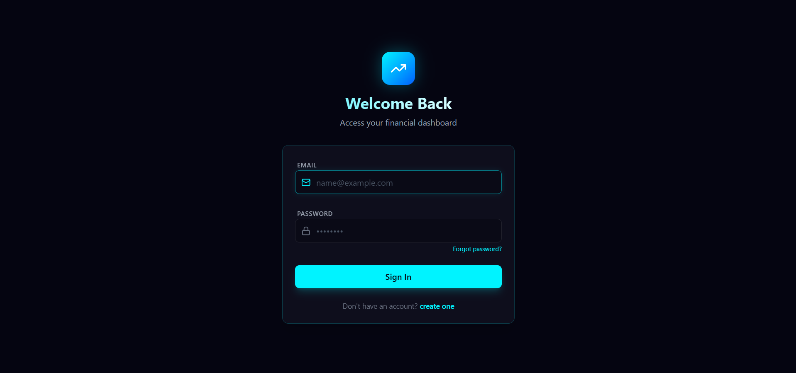
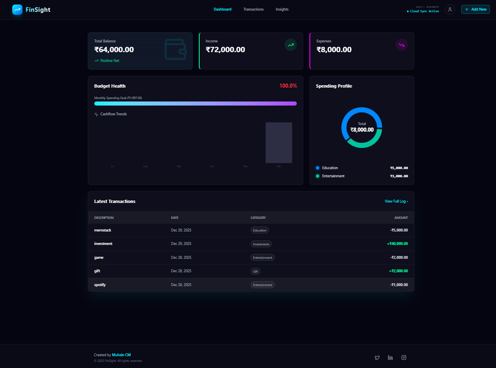
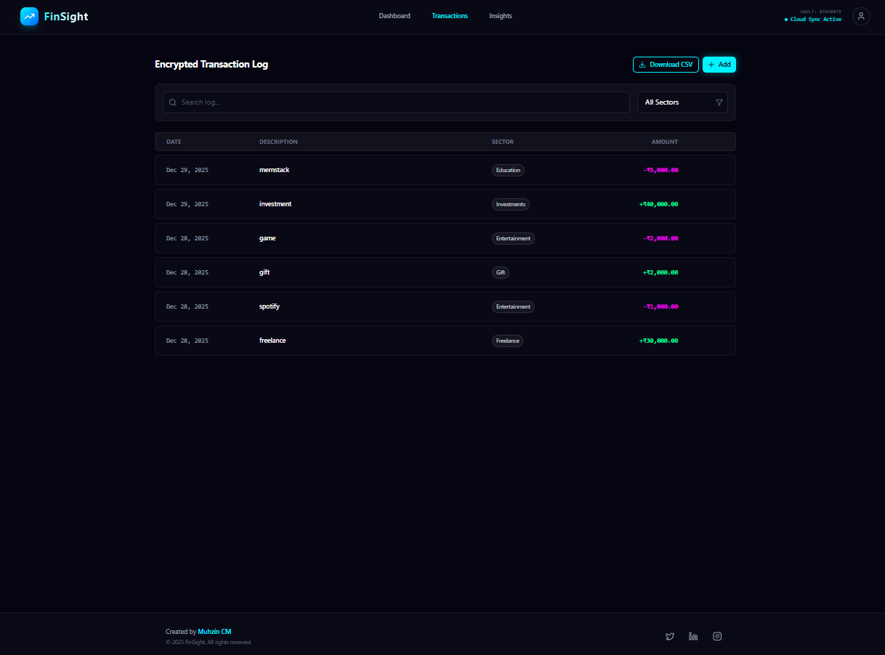
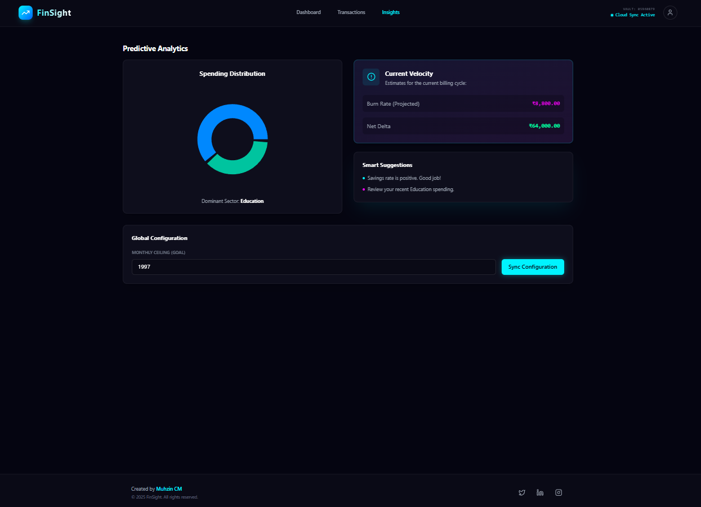

# FinSight
## 🔗 Live Demo
[https://finsight-liart.vercel.app/login]

## 📖 Description
FinSight is a modern, neon-themed personal finance tracker designed for individuals who want a visually striking and efficient way to manage their money. It combines cyberpunk aesthetics with powerful ledger features to provide a premium budgeting experience.

## ✨ Features
- **Encrypted Transaction Log**: Real-time logging of income and expenses with detailed sector tagging and filtering.
- **Interactive Spending Profile**: Visual analytics using dynamic charts to track and categorize spending habits at a glance.
- **Secure Vault Architecture**: Integrated cloud sync simulation with vault status monitoring for a high-tech feel.
- **Premium User Profiles**: Dedicated profile management for personal settings and account security.
- **Responsive design for all devices**: Seamless experience across mobile, tablet, and desktop screens.

## 🎯 Project Goals
The main goal of this project was to create a high-fidelity React application that balances extreme visual aesthetics (Cyberpunk/Neon style) with practical utility. I aimed to master Tailwind CSS v4, responsive layout architecture, and Firebase integration while delivering a "wow" factor through modern UI design.

## 🛠️ Technologies Used
- **Frontend:** React.js (Vite)
- **Styling:** Tailwind CSS v4, Lucide React (Icons)
- **APIs:** Firebase (Authentication & Firestore)
- **Libraries:** React Router, Recharts, `clsx`, `tailwind-merge`
- **Deployment:** Vercel

## 🚀 Setup Instructions
### Prerequisites
- Node.js (v14 or higher)
- npm or yarn

### Installation Steps
1. Clone the repository
```bash
git https://github.com/muhzincm8-dot/Mini-Project.git
cd fin-sight
```
2. Install dependencies
```bash
npm install
```
3. Create .env file (if using APIs)
```env
VITE_FIREBASE_API_KEY=your_api_key_here
```
4. Start development server
```bash
npm run dev
```
5. Open http://localhost:5173 in your browser

## 📱 Responsive Design
This application is fully responsive and tested on:
- ● Mobile devices (375px and up)
- ● Tablets (768px and up)
- ● Desktop (1024px and up)

## 📸 Screenshots







## 🎨 Design Choices
- **Cyberpunk Aesthetic**: Used a "Neon-on-Dark" color palette (Neon Blue, Pink, Green) to create a high-contrast, tech-forward look.
- **Glassmorphism**: Implemented semi-transparent surfaces with backdrop-blur for a premium, layered feel.
- **Micro-animations**: Added subtle transitions and hover effects to interactive elements to improve user engagement.

## 🐛 Known Issues
- Currently optimized for modern browsers; older IE versions are not supported.

## 🔮 Future Enhancements
- ● AI-driven budget suggestions based on spending trends.
- ● Multi-currency support for international users.
- ● Direct bank API integration for automated transaction syncing.

## 👤 Author
Muhzin CM
- ● GitHub: https://github.com/muhzincm8-dot
- ● LinkedIn: www.linkedin.com/in/muhzin-cm-26404a388
- ● Email: muhzincm8@gmail.com

## 📄 License
This project is open source and available under the Name Muhzin CM.

## 🙏 Acknowledgments
- ● Icons provided by [Lucide React](https://lucide.dev/).
- ● UI inspiration from modern dashboard designs on Dribbble.
- ● Deployment hosted by [Vercel](https://vercel.com/).
